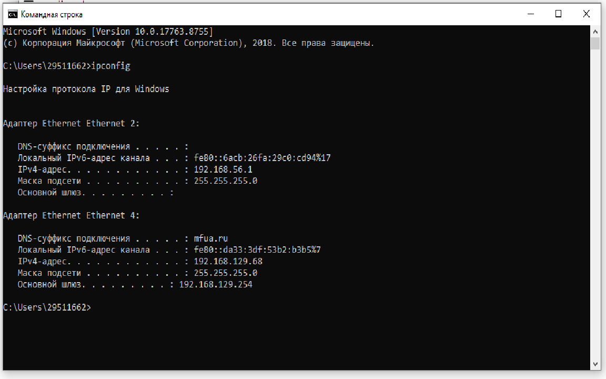
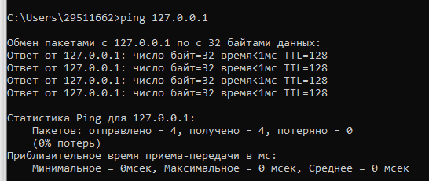
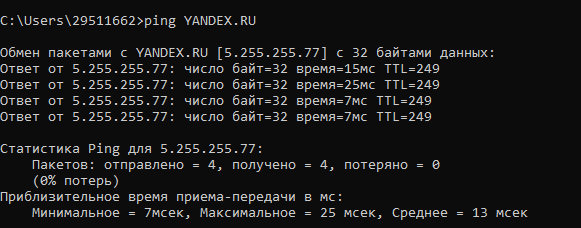
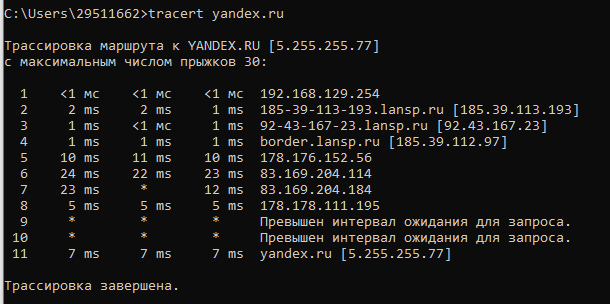
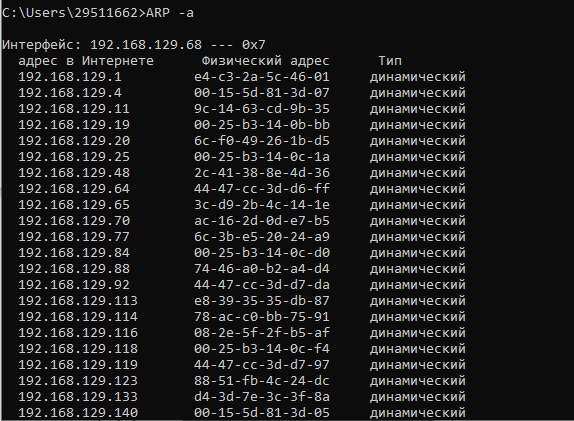

# Лабораторная работа №2 #
## «Изучение программных тестирования и определения параметров настройки в компьютерных сетях» ##
**Цель работы:** приобретение знаний и практических навыков в
использовании программного обеспечения для настройки и тестирования
компьютерной сети.

**Материалы, оборудование, программное обеспечение:** лаборатория,
оснащенная персональными компьютерами, объединенными в локальную сеть
с доступом в Интернет, утилиты сканирования беспроводных сетей.

Определили свой ip в сети

имя устройства в сети

Скорость передачи информации в локальной сети

Скорость подключения к яндексу

пакеты яндекс

ARP-таблица

